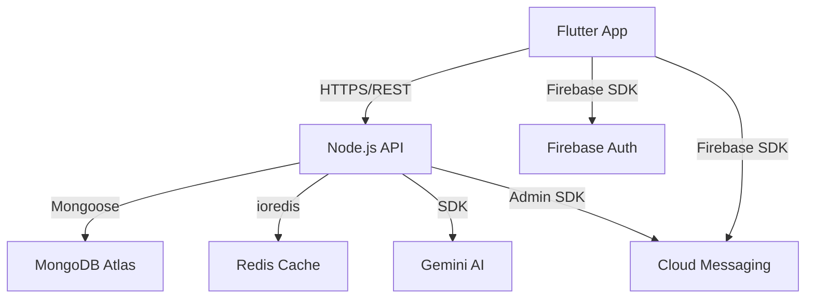

# Architecture

> Generated by /map on 2026-03-22

## Overview
WattWise is a comprehensive energy management platform built as a monorepo. It empowers users to track energy consumption, manage appliances, analyze bills via OCR, and receive AI-driven efficiency plans to reduce costs and environmental impact.

## System Diagram

## Internal Structure

### Monorepo Layout
- `/backend`: Node.js Express server.
- `/wattwise_app`: Flutter application.
- `/docs`: Project documentation.
- `/scripts`: Utility scripts for development/deployment.

## Components

### Backend (Express API)
- **Purpose:** Handles business logic, data persistence, AI integration, and bill parsing.
- **Location:** `backend/src`
- **Architecture:** Controller/Service/Repository pattern.
- **Key Modules:**
  - `controllers`: Request handling and response formatting.
  - `services`: Core business logic (AI logic, Bill processing).
  - `repositories`: Data access layer abstraction.
  - `middleware`: Security, authentication, and error handling.

### Frontend (Flutter App)
- **Purpose:** User interface for dashboard, plans, insights, and bill management.
- **Location:** `wattwise_app/lib`
- **Architecture:** Feature-first modular structure with Riverpod state management.
- **Core Features:**
  - `dashboard`: Real-time consumption overview.
  - `plans`: AI-generated energy saving tasks.
  - `insights`: Visualizations of usage patterns.
  - `bill`: OCR-based bill upload and tracking.

## Data Flow
1. **User Action:** User uploads a bill in the Flutter app.
2. **Processing:** App sends image to Google ML Kit for OCR (local) or Backend for parsing.
3. **Storage:** Backend validates and stores the bill data in MongoDB.
4. **Insights:** Backend triggers Gemini AI to generate customized saving advice based on new bill data.
5. **Feedback:** App receives push notification (FCM) when AI plan is ready.

## Integration Points
| External Service | Type | Purpose |
|------------------|------|---------|
| MongoDB Atlas | Database | Primary persistent storage for users, bills, and plans. |
| Redis | Cache | Rate limiting and session/data caching. |
| Google Gemini AI | AI Engine | Generating energy efficiency insights and plans. |
| Firebase Auth | Auth | User authentication and session management. |
| Firebase CM | Messaging | Push notifications for alerts and plan updates. |
| Google ML Kit | SDK | Local text recognition for bill OCR. |

## Conventions
- **Naming:** CamelCase for classes/files (Dart), camelCase for variables, hyphen-sep for folders (JS).
- **Structure:** Domain-driven features in Flutter, Service-Repository in Backend.
- **Testing:** Jest for Backend, Flutter Test for Frontend.
- **Git:** Semantic commits followed via Husky and Commitlint.

## Technical Debt
- [ ] Implement robust error logging service (e.g. Sentry) for production.
- [ ] Add unit tests for `ai.service.js` complex logic.
- [ ] Refactor local storage logic in Flutter to a unified repository pattern.
